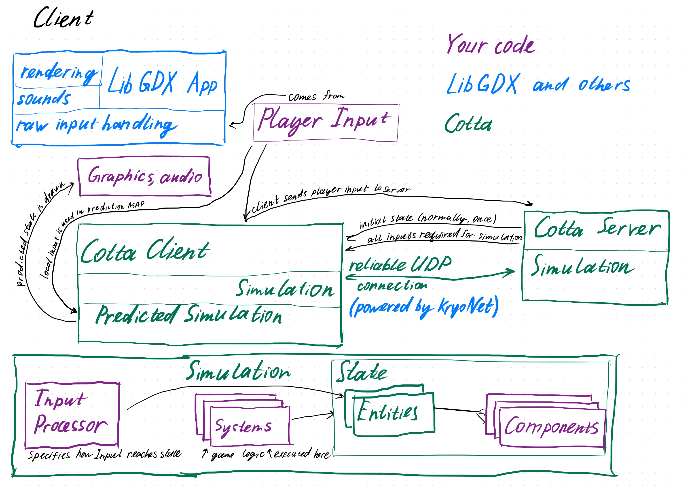

# Architecture overview
Cotta does not make assumptions about the main framework or library that you use
for your game, but was built with LibGDX in mind.

## Roles
- LibGDX (or similar) is used to render the game and handle raw user input
- Developer writes game logic in Systems (MovementSystem, DamageSystem, etc.)
- Developer defines Components required (Position, Velocity, Health...)
- Developer defines Player Input in game terms, not keys and mouse terms
  ("Look at", "WASD pressed", "Fire")
- Developer writes a mechanism to convert raw input to Player Input
- And also a mechanism to put data from Player Input into some specific
Components of some specific Entities
- Cotta Client sends Player Input from Client to Server
- Cotta Server collects Player Inputs from all Clients
- Cotta Server runs the simulation by executing all Systems repeatedly at a fixed rate
- Cotta sends State from Server to Client (it happens once)
- Cotta sends all Player Inputs from Server to Client so that Client can also
run the simulation
- Cotta Client runs **exactly same** simulation
- Cotta Client uses Player Inputs that were collected locally but not yet used
in the Authoritative simulation, then applies all of them to the Predicted
simulation - it helps to maintain smoothness regardless of latency
