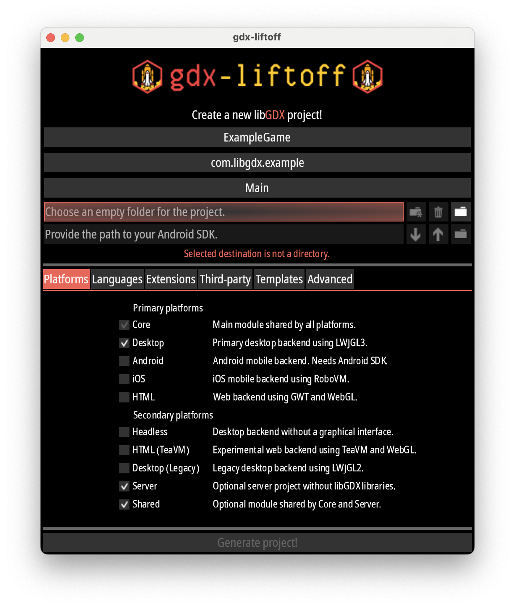
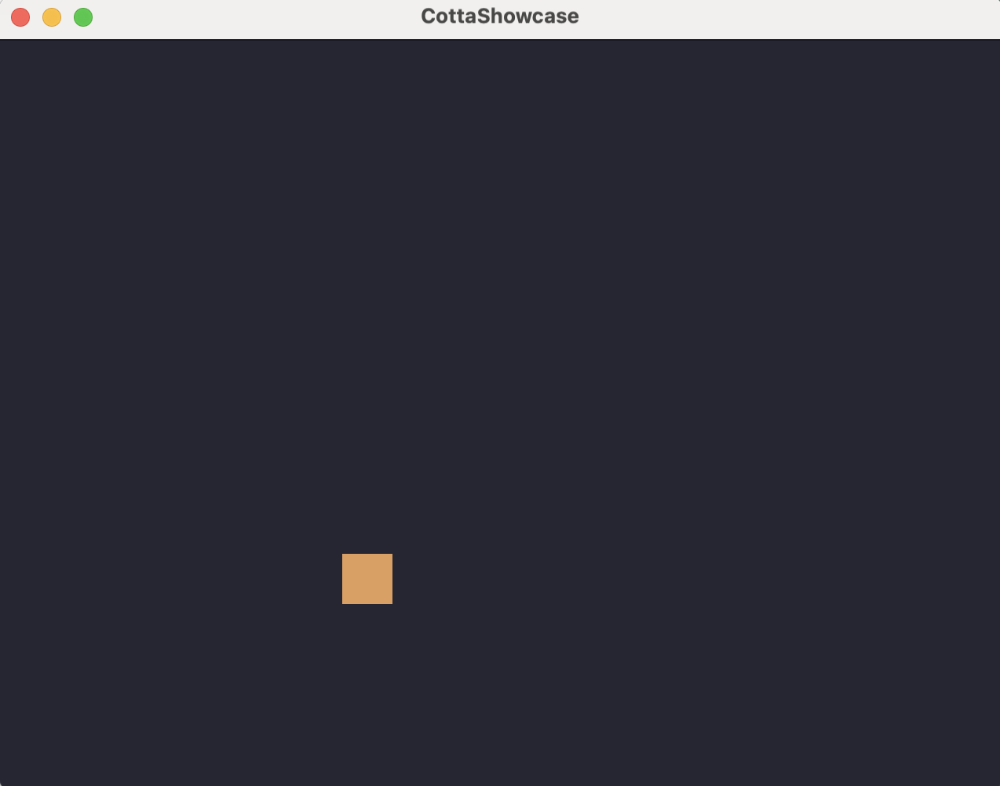

# Quick start
## Overview
Here we will create a simple multiplayer game using Cotta and LibGDX. The game
is a networked 2D application where each player can move a square around using
WASD. No shooting, no jumping, no nothing. Just moving for now, to not make this
guide too overwhelming. Other features of the engine will be covered in later
chapters.

The guide assumes some basic knowledge of Gradle, Kotlin and LibGDX.

The plan is roughly as follows:
- Initialize a LibGDX project
- Add Cotta dependencies to the project
- Define the game class
- Define components
- Implement a system
- Define player input class
- Write some code to convert GDX input to player input we configured
- Write some code to actually put input into the simulation
- Launch and see the game in action
- Try cool features of Cotta such as prediction and interpolation

## Simplest project possible
### Initialize a LibGDX project
The project called `gdx-liftoff` is a good starting point. Just follow the
instructions in the [project's README](https://github.com/libgdx/gdx-liftoff).

Since we're developing a multiplayer game, in addition to the default
**Desktop** and **Core** modules, you should also check
- **Server** - here we will start the Server
- **Shared** - here we will put the game logic, components, systems, config etc.



And on the "Languages" tab check **Kotlin**. And generate and open in IDE(A).

### Add Cotta dependencies to the project
Add `jitpack.io` to your repositories section, if not yet:
```gradle
repositories {
    maven { url 'https://jitpack.io' }
}
```

Define the version of Cotta in the root `gradle.properties`:
```properties
cottaVersion='0.1.1'
```

The submodules in the resulting project need the dependencies as follows:
- **server** needs `cotta-server`
- **shared** needs `cotta-core` and `cotta-annotations-processor`
- **core** needs `cotta-gdx`

#### Server
Add the following:
```gradle
dependencies {
  ...
  implementation "com.mgtriffid.cotta:cotta-server:$cottaVersion"
}
```

#### Core
Add the following:
```gradle
dependencies {
  ...
  implementation "com.mgtriffid.cotta:cotta-gdx:$cottaVersion"
}
```

#### Shared
Add the following:
```gradle
apply {
  plugin("com.google.devtools.ksp")
}

dependencies {
  ...
  implementation "com.mgtriffid.cotta:cotta-core:$cottaVersion"
  ksp "com.mgtriffid.cotta:cotta-annotations-processor:$cottaVersion"
}
```

### Write game logic
All code in this section should be put into the **shared** module.

#### Game class
A game using Cotta needs to be defined in a specific way. It must be a class
that extends `CottaGame` and is annotated with `@Game`. Like this:
```kotlin
@Game
class ShowcaseGame : CottaGame {
    override val config: CottaConfig = ShowcaseConfig()

    override val inputProcessing: InputProcessing = ShowcaseInputProcessing()

    override val playerInputKClass = ShowcasePlayerInput::class

    override val playersHandler = ShowcasePlayersHandler()

    override val systems: List<CottaSystem> = listOf()
}
```

You also need to define these classes `ShowcaseConfig`, `ShowcasePlayerInput`, 
`ShowcaseInputProcessing`, `ShowcasePlayersHandler`.

`ShowcaseConfig` contains configuration like tick length and network settings.
For now let's just configure the `tickLength` and leave everything else as
default:

```kotlin
class ShowcaseConfig : CottaConfig {
    override val tickLength: Long = 33L // to tick roughly 30 times per second
}
```

Since we're making player move around with WASD, one byte of information for
walking direction is enough for us. Note that we don't put "W pressed" things
here, because that is related to control, not to actual game logic input. We
define `ShowcasePlayerInput` in terms of actual game and not keyboard like this:

```kotlin
data class ShowcasePlayerInput(
    val walkingDirection: Byte
) : PlayerInput

object WalkingDirections {
    const val IDLE: Byte = 0
    const val UP: Byte = 1
    const val DOWN: Byte = 2
    const val LEFT: Byte = 3
    const val RIGHT: Byte = 4
}
```

For now, we will leave the remaining two classes empty. We will fill them later
when components are ready:

```kotlin
class ShowcaseInputProcessing : InputProcessing {
    override fun processPlayerInput(
        playerId: PlayerId,
        input: PlayerInput,
        entities: Entities,
        effectBus: EffectBus
    ) {
        // will fill this later
    }
}
```

```kotlin
class ShowcasePlayersHandler : PlayersHandler
```

#### Components
Components are the data that entities have. Cotta requires them to reside in the
same package as the game class, or in a nested sub-package. So if you had a
package like `com.example.game`, you can put components in the 
`com.example.game.components` package.

Components are defined as interfaces, then `cotta-annotation-processor` uses
Google's [KSP](https://github.com/google/ksp) to generate implementations.

Let's define components for position and to mark an entity as controlled by a
player:

```kotlin
interface PositionComponent : MutableComponent<PositionComponent> {
    var x: Float
    var y: Float
}
```

```kotlin
interface ControllableComponent : MutableComponent<ControllableComponent> {
    var direction: Byte
    val playerId: PlayerId
}
```

Run `gradle clean build` now to ensure that it builds. KSP should generate the
implementation classes for these components. Using your IDE look for a file
`PositionComponentImpl.kt` located in
`shared/build/generated/ksp/main/kotlin/.../components/PositionComponentImpl.kt`.
If it's not there - something went wrong, please double-check that you have
added KSP plugin and dependencies correctly.

#### System
Systems are the logic that runs on entities. We will define a system that moves
our entities that have both `PositionComponent` and `ControllableComponent`:

```kotlin
class MovementSystem : EntityProcessingSystem {
    override fun process(e: Entity, ctx: EntityProcessingContext) {
        if (e.hasComponent(ControllableComponent::class) &&
            e.hasComponent(PositionComponent::class)
        ) {
            val controllable = e.getComponent(ControllableComponent::class)
            val position = e.getComponent(PositionComponent::class)
            val velX = when (controllable.direction) {
                WalkingDirections.LEFT -> -300f
                WalkingDirections.RIGHT -> 300f
                else -> 0f
            }
            val velY = when (controllable.direction) {
                WalkingDirections.UP -> 300f
                WalkingDirections.DOWN -> -300f
                else -> 0f
            }
            // ctx.clock().delta() is frame time in seconds basically:
            position.x += velX * ctx.clock().delta()
            position.y += velY * ctx.clock().delta()
        }
    }
}
```

As of version `0.1.1`, all `EntityProcessingSystem`s are called for all
Entities, so we need to check for components existence here to filter out those
that don't have to be moved (if we have any). In the future this API will likely
change.

Now add this system to the list of systems in the `ShowcaseGame` class:

```kotlin
@Game
class ShowcaseGame : CottaGame {
    // ...
    
    override val systems: List<CottaSystem> = listOf(MovementSystem())
}
```

#### `PlayersHandler` to handle players joining/leaving
The `ShowcasePlayersHandler` will create an Entity for each player that joins
and remove it once player leaves:

```kotlin
class ShowcasePlayersHandler : PlayersHandler {
    override fun onEnterGame(playerId: PlayerId, entities: Entities) {
        // ownedBy matters for prediction:
        entities.create(ownedBy = Entity.OwnedBy.Player(playerId)).apply {
            // createControllableComponent function is generated by KSP during build
            addComponent(createControllableComponent(0, playerId))
            addComponent(createPositionComponent(120f, 120f))
        }
    }

    override fun onLeaveGame(playerId: PlayerId, entities: Entities) {
        val entityId = entities.all().find { it.ownedBy == Entity.OwnedBy.Player(playerId) }?.id
        if (entityId != null) {
            entities.remove(entityId)
        }
    }
}
```

#### Put actual player's input into Entities
We saw that we have that `ControllableComponent` that has `direction` field. We
know it is used in the `MovementSystem`. But we haven't yet wrote a piece of
code that would deliver `direction` from `ShowcasePlayerInput` to
`ControllableComponent`. Now we do so:

```kotlin
class ShowcaseInputProcessing : InputProcessing {
    override fun processPlayerInput(
        playerId: PlayerId,
        input: PlayerInput,
        entities: Entities,
        effectBus: EffectBus
    ) {
        val character = getCharacter(entities, playerId) ?: return
        val controllable = character.getComponent(ControllableComponent::class)
        controllable.direction = (input as ShowcasePlayerInput).walkingDirection
    }

    private fun getCharacter(entities: Entities, playerId: PlayerId): Entity? {
        return entities.all().find { it.ownedBy == Entity.OwnedBy.Player(playerId) }
    }
}
```

Shared module is ready now. Let's move to the **core** module.

### Core module
#### Convert GDX input to `ShowcasePlayerInput`
For this we will implement a special interface `CottaGdxClientInput` like this:
```kotlin
class ShowcaseCottaClientGdxInput : CottaClientGdxInput {
    private val storage = Storage()

    // Supposed to be called as frequently as possible - in render() calls.
    // Since render() may be called more often than game simulation ticks,
    // we accumulate inputs to a special Storage.
    override fun accumulate() {
        with(storage) {
            upPressed = upPressed || Gdx.input.isKeyPressed(Input.Keys.W)
            downPressed = downPressed || Gdx.input.isKeyPressed(Input.Keys.S)
            leftPressed = leftPressed || Gdx.input.isKeyPressed(Input.Keys.A)
            rightPressed = rightPressed || Gdx.input.isKeyPressed(Input.Keys.D)
        }
    }

    override fun input(): ShowcasePlayerInput {
        return ShowcasePlayerInput(
            when {
                storage.upPressed && !storage.downPressed -> WalkingDirections.UP
                !storage.upPressed && storage.downPressed -> WalkingDirections.DOWN
                storage.leftPressed && !storage.rightPressed -> WalkingDirections.LEFT
                !storage.leftPressed && storage.rightPressed -> WalkingDirections.RIGHT
                else -> WalkingDirections.IDLE
            },
        ).also { clear() }
    }

    private fun clear() {
        storage.upPressed = false
        storage.downPressed = false
        storage.leftPressed = false
        storage.rightPressed = false
    }

    private class Storage {
        var upPressed: Boolean = false
        var downPressed: Boolean = false
        var leftPressed: Boolean = false
        var rightPressed: Boolean = false
    }
}
```

This was straightforward.

#### Add some code to make it convenient to call Cotta from java

Under the `kotlin` folder of the `core` module create a package and there add
a file `DrawableComponents.kt`

[//]: # (TODO remove this, make this guide use Kotlin everywhere)

```kotlin
fun getDrawableComponentClasses(): List<KClass<Component<*>>> = listOf(
    position as KClass<Component<*>>
)

val position = PositionComponent::class

```

#### Make the game run CottaClient

Add the following lines to the `create()` method of `Main` class:
```java
    @Override
    public void create() {
        batch = new SpriteBatch();
        image = new Texture("libgdx.png");
        character = new Texture("square.png");
        CottaGame game = new ShowcaseGame();
        gdxAdapter = new CottaGdxAdapter(game, new ShowcaseCottaClientGdxInput());
        gdxAdapter.initialize();
    }
```
This code creates an instance of your game, passes it to the `CottaGdxAdapter`
which will actually run the game, along with the `ShowcaseCottaClientGdxInput`.

And create some `square.png` sprite, like 32x32, and put it into the `assets`
folder of the project.

Next, change the `render()` method as follows:
```java
@Override
public void render() {
    Gdx.gl.glClearColor(0.15f, 0.15f, 0.2f, 1f);
    Gdx.gl.glClear(GL20.GL_COLOR_BUFFER_BIT);
    UpdateResult result = gdxAdapter.invoke(); // attempt to tick the game
    if (result instanceof UpdateResult.Running) {
        draw((UpdateResult.Running) result);
    } else {
        batch.begin();
        batch.draw(image, 140, 210);
        batch.end();
    }
}

private final List<KClass<Component<?>>> drawableComponents = DrawableComponentsKt.getDrawableComponentClasses();

private void draw(UpdateResult.Running result) {
    DrawableState state = gdxAdapter.getDrawableState(result.getAlphas(), drawableComponents);
    batch.begin();
    if (state instanceof DrawableState.Ready) {
        for (Entity entity : ((DrawableState.Ready) state).getEntities()) {
            // here we actually draw the entities as squares
            PositionComponent positionComponent = entity.getComponent(DrawableComponentsKt.getPosition());
            batch.draw(character, positionComponent.getX(), positionComponent.getY());
        }
    }
    batch.end();
}
```

So the whole `Main` class should look like this:
```java
public class Main extends ApplicationAdapter {
    private SpriteBatch batch;
    private Texture image;
    private Texture character;
    private CottaGdxAdapter gdxAdapter;

    private final List<KClass<Component<?>>> drawableComponents = DrawableComponentsKt.getDrawableComponentClasses();

    @Override
    public void create() {
        batch = new SpriteBatch();
        image = new Texture("libgdx.png");
        character = new Texture("square.png");
        CottaGame game = new ShowcaseGame();
        gdxAdapter = new CottaGdxAdapter(game, new ShowcaseCottaClientGdxInput());
        gdxAdapter.initialize();
    }

    @Override
    public void render() {
        Gdx.gl.glClearColor(0.15f, 0.15f, 0.2f, 1f);
        Gdx.gl.glClear(GL20.GL_COLOR_BUFFER_BIT);
        UpdateResult result = gdxAdapter.invoke();
        if (result instanceof UpdateResult.Running) {
            draw((UpdateResult.Running) result);
        } else {
            batch.begin();
            batch.draw(image, 140, 210);
            batch.end();
        }
    }

    private void draw(UpdateResult.Running result) {
        DrawableState state = gdxAdapter.getDrawableState(result.getAlphas(), drawableComponents);
        batch.begin();
        if (state instanceof DrawableState.Ready) {
            for (Entity entity : ((DrawableState.Ready) state).getEntities()) {
                PositionComponent positionComponent = entity.getComponent(DrawableComponentsKt.getPosition());
                batch.draw(character, positionComponent.getX(), positionComponent.getY());
            }
        }
        batch.end();
    }

    @Override
    public void dispose() {
        batch.dispose();
        image.dispose();
        character.dispose();
    }
}
```

### Server module
This is short.
Create a `ShowcaseServer` Kotlin class:
```kotlin
class ShowcaseServer {
    fun start() {
        CottaServerFactory()
            .create(ShowcaseGame())
            .initializeInstances()
    }
}
```

and make the `ServerLauncher` run it:

```java
public class ServerLauncher {
    public static void main(String[] args) {
        new ShowcaseServer().start();
    }
}
```

## Running the game
Once again do `gradle clean build` to ensure that everything is fine.

Then run `gradle server:run` to start the Server.

Then wait for couple seconds and run `gradle lwjgl3:run` to start the Client.

You should see a square that you can move around with WASD keys:


## Now the cool part: prediction and interpolation

### Problem
When you move the square around, you may notice that it doesn't move smoothly,
it jitters visibly. And also the response is not instant. This is because the
square is moved only when our input travels to the server and then travels back,
and only then client simulation takes this input into account. If you don't see
these problems easily, then try to increase the `tickLength` to like `100L`.

### Solution
Annotate the `MovementSystem` with `@Predicted`:
```kotlin
@Predicted
class MovementSystem : EntityProcessingSystem {
    // ...
}
```

Annotate both fields of the `PositionComponent` as `@Interpolated`:
```kotlin
interface PositionComponent : MutableComponent<PositionComponent> {
    @Interpolated var x: Float
    @Interpolated var y: Float
}
```

Clean, build, launch server, launch client. See the difference. Now the response
time is within the tick length, and the square moves smoothly.

These and other features will be covered in further guides.

## Code
All code from here is available here https://github.com/mgtriffid/cotta-showcase ,
revision [78db8dc2f48f25ddcfaf10d5ecf10ffe9050b378](https://github.com/mgtriffid/cotta-showcase/commit/78db8dc2f48f25ddcfaf10d5ecf10ffe9050b378)


## Next
Next let's get to know [Effects](effects.md).
